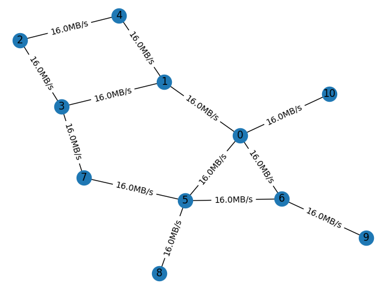
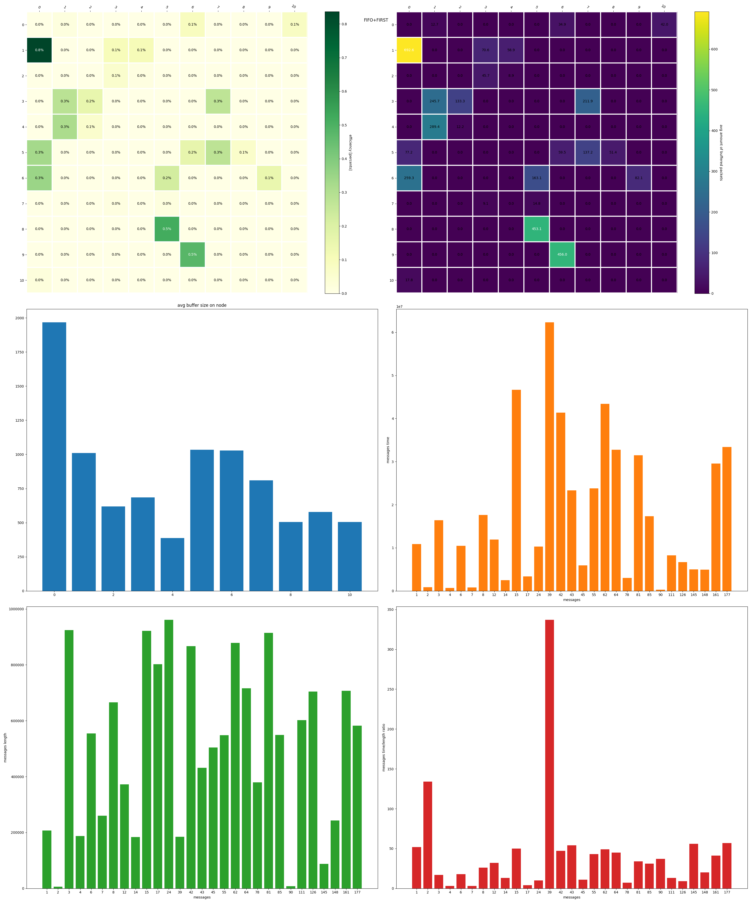
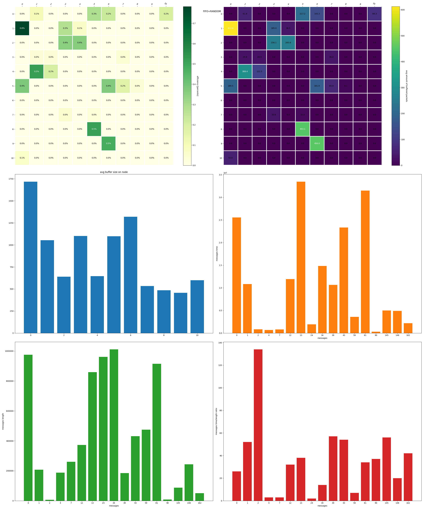
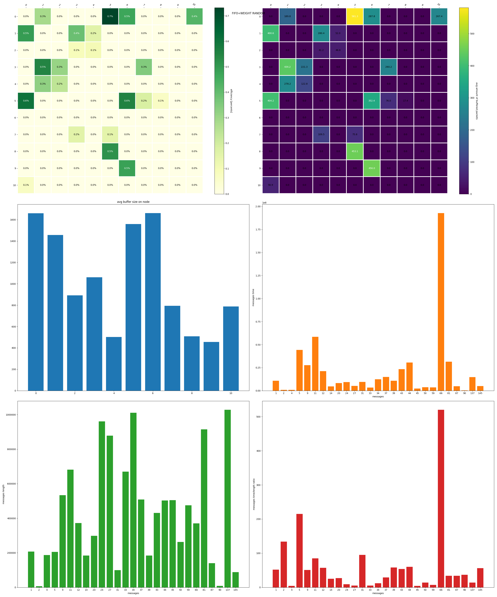
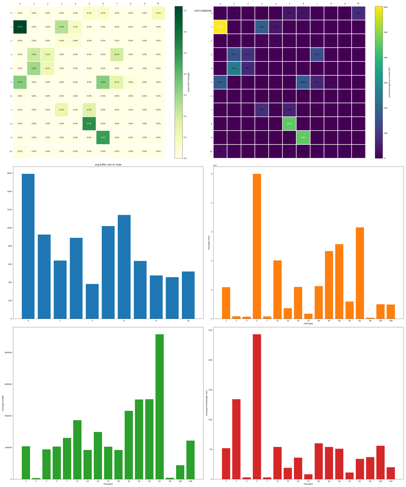
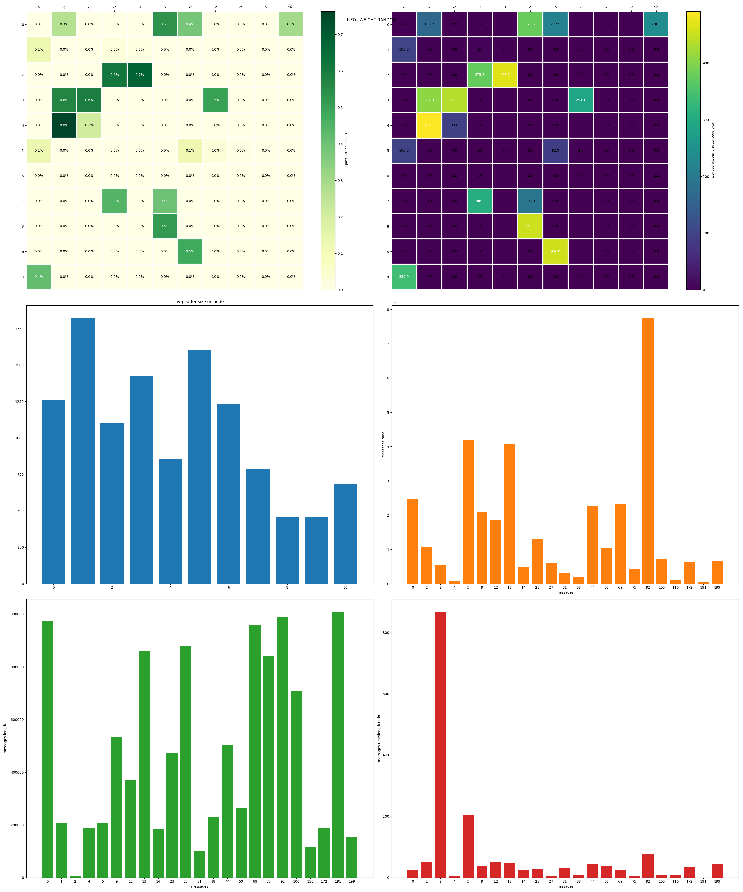
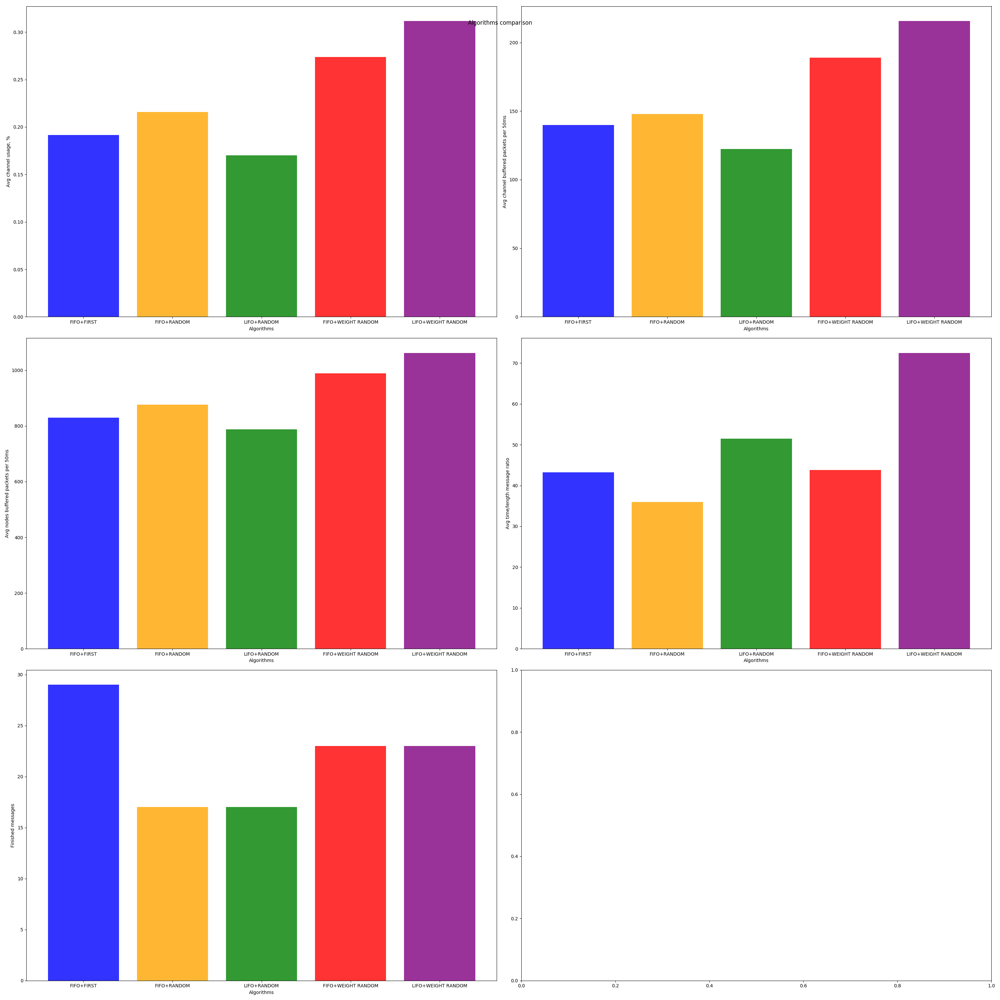

# Мережева симуляція

Дана робота виконана Токарєвим Павлом, група МФ-41, 
факультет Математики і інформатики, ХНУ ім Каразіна.

## Завдання
Розробити модель мережі та декілька стратегій обробки черг маршрутування
і балансування навантаження між каналами зв'язку і 
методом порівняння визначити найбільш ефективну їх 
комбінацію з точки зору утилізації ресурсів мережі 
(пропускної здатності, величини черг повідомлень на вузлах)
і, за можливості, часу доставки пакетів та різних типів трафіку.

## Виконано

Розроблений рушій для симуляції ([event loop](event_loop.py) та [framework](framework.py))
та декілька комбінацій стратегій обробки черг і балансування.

## Рушій

Рушій розроблено на основі системи подій (`event-based simulation`) 
та функцій-обробників цих подій. Цикл обробки подій наповнюється
початковими подіями, які сортуються за часом їх появи. Коли
подія повинна бути оброблена, визивається обробник, що 
відповідає типу події.

Даний цикл продовжується до тих пір, поки не закінчаться події
у черзі або не буде перевищений час виконання симуляції 
(який можна не вказувати, якщо Ви знаєте, що ця система подій сходиться/закінчується).

Даний рушій розроблявся з розрахунком на обмеження 
роздільної здатності часу до наносекунди — Ви можете повертати не цілий 
час появи повідомлення, але це теоретично може вплинути на продуктивність
симуляції через операції над числами з плаваючою точкою.

## Мережа

Мережа визначається наборами комп'ютерів та каналів між ними. Комп'ютери у свою чергу визначаються 
своїм IP (на даний момент просто ціле число задля простоти), чергою повідомлень, набором
інтерфейсів (доступних каналів) та таблицею маршрутизації. Канали пов'язують два комп'ютери,
мають чергу повідомлень, та швидкість цього з'єднання (наносекунд/байт).

Таблиці маршрутизації формуються статичними, до початку самої симуляції.
Стратегією побудови цих таблиць є: кожен комп'ютер мережі формує 
спеціальний пакет у вигляді події для кожного 
з'єднання, що він має. У цьому пакеті він повідомляє про себе.
Коли цей пакет доходить до вузла, цей вузол добавляє запис до таблиці маршрутизації про те, 
через який інтерфейс IP даного вузла може бути доступний, та розмилає 
таке ж повідомлення до усіх своїх сусідів. Якщо цей IP та інтерфейс 
вже є у таблиці, таблиця може бути модифікована тільки якщо у таблиці
метрика для інтерфейса більша, за нову; повідомлення до сусідів не відправляється.

Так як вузли не розсилають повідомлення сусідам у разі запису у таблиці 
(тобто є захист від циклів), алгоритм формування таблиць сходиться.

Симуляція мережі базується на наступних типах подій:
- зупинки часу: періодична подія, що дозволяє збирати статистику виконання мережі.
- нового з'єднання: повертає набір подій пакетів на вузлі відправки;
- нового пакета: додає пакет у чергу на маршрутизацію;
- маршрутизації: оброблює один пакет з черги вузла, додає пакет у якийсь з каналів,
або поглинає, якщо цей пакет адресовано цьому вузлу;
- передачі пакета: подія передачі пакета у якомусь каналі, може бути зіпсовано подією помилки;
- помилки передачі у каналі: позначає канал таким, що помилка передачі відбулася у даний час;
прибирається наступним пакетом.

Усі ці події оброблюються методами класу `Networking`, 
який користувач може заміняти на свій підклас.

Виникнення усіх подій (якщо не зазначено) симулюється окремим 
пуасонівським процесом зі своїм "лямбда".

Генераця появи нових повідомлень у мережі наразі не регулюється додатковими
рисами вузлів (як от вага вузла в генерації, для популярних сервісів, наприклад),
окрім як рисами клієнта та сервера (за замовчуванням вузол є і клієнтом, 
і сервером, і роутером, що значить, що повідомлення генеруються між усіма вузлами).

## Алгоритми та стратегії

### FIFO обробка черги
Обирає найдавніший (перший) елемент черги.

### LIFO обробка черги
Обирає наймолодший (кінцевий) елемент черги.

### FIRST маршрутизація
Перший канал з записів маршрутизації для даного IP.

### RANDOM маршрутизація
Канал для передачі повідомлення вибирається випадково-рівнозважено з наявних.

### WEIGHT RANDOM маршрутизація
Шанс вибору канал для передачі повідомлення є більшим для тих каналів, для
яких більша метрика (кумулятивний час на байт).

## Результати

Далі наведені результати симуляцій для наступного графа:

Усі симуляції відбувалися напротязі однієї **секунди**, 
з кроком збору статистики **50 мілісекунд**. Маршрутизація одного пакета відбувається за
**50 наносекунд**, час між пакетами становить **10 наносекунд**. Повідомлення розбивається
на пакети розміром у **кібібайт** з остачею у вигляді залишкового пакета довільної довжини
до кібібайта. Ці пакети віддаються у чергу повідомлень пуасонівським процесом з розрахунком
на **1 пакет на мілісекунду**. Кожне нове з'єднання генерується пуасонівським процесом
з розрахунком на **1 з'єднання на 5 мілісекунд**.

Для даних констант проведені 5 експериментів різних комбінацій стратегій.
Результати наведені нижче:

Легенда (зліва напрво, зверху вниз, середні з кроком 50мс):
1. теплова карта ефективності (відношення використання до простою) каналу;
2. теплова карта середньої кількості буферизованих пакетів у каналів;
3. графік середньо кількості буферизованих пакетів вузлів;
4. графік часу доставлених повідомлень (різниця між часом створення повідомлення і
доставки на вузол);
5. графік довжин доставлених повідомлень (у байтах);
6. графік відношення часу на розмір повідомлення.

Порівняння:

Легенда:
1. середня ефективність каналу;
2. середня кількість буферизованих пакетів каналу на кожні 50мс;
3. середня кількість буферизованих пакетів вузла на кожні 50мс;
4. середнє відношення часу до розміру повідомлень (aka latency);
5. кількість доставлених повідомлень за час симуляції.

## Висновки

## Що можна зробити ще

Дані симуляції бракують динамічної зміни таблиць маршрутизації 
та більш тонкого налаштування мережі: дана мережа достатньо статична, тоді
як у реальних різні вузли мають різні характеристики, канали мають разні швидкості
як у різних частинах мережі, так і з'єднанні двох вузлів між собою (більша швидкість
на завантаження, ніж на вивантаження, наприклад).
Дані можливості вже доступні всередині рушія, але не можуть бути налаштовані ззовні
так як потребують ґрунтовної роботи з перевірки коректності усіх цих параметрів
та відшліфування їх інтерфейсів, що, нажаль, наразі недоступно через брак часу.

У мережі також відсутні такий вид трафіку, як TCP (наразі симулюється по суті, лиш
UDP), який є важливим елементом сучасних мереж, і його симуляція є корисною. Також
це дозволило би симуляцію змішаного навантаження, UDP+TCP.

Також, можна було би симулювати різні типи навантаження, базуючись на якихось
рисах вузлів, наприклад, популярний сервіс, на який симулюється сильне навантаження
разом з супутнім, непов'язаним з ним, трафіком самої мережі.
