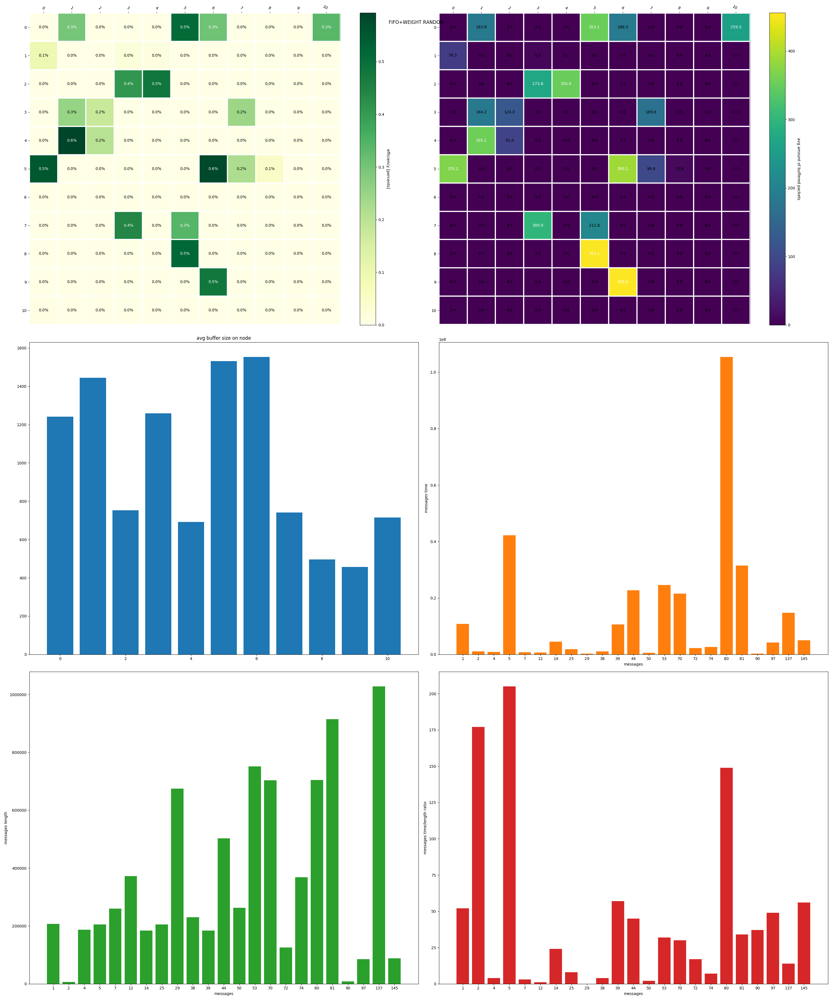

# Мережева симуляція

Дана робота виконана Токарєвим Павлом, група МФ-41, 
факультет Математики і інформатики, ХНУ ім Каразіна.

## Завдання
Розробити модель мережі та декілька стратегій обробки черг маршрутування
і балансування навантаження між каналами зв'язку і 
методом порівняння визначити найбільш ефективну їх 
комбінацію з точки зору утилізації ресурсів мережі 
(пропускної здатності, величини черг повідомлень на вузлах)
і, за можливості, часу доставки пакетів та різних типів трафіку.

## Виконано

Розроблений рушій для симуляції ([event loop](event_loop.py) та [framework](framework.py))
та декілька комбінацій стратегій обробки черг і балансування.

## Рушій

Рушій розроблено на основі системи подій (`event-based simulation`) 
та функцій-обробників цих подій. Цикл обробки подій наповнюється
початковими подіями, які сортуються за часом їх появи. Коли
подія повинна бути оброблена, визивається обробник, що 
відповідає типу події.

Даний цикл продовжується до тих пір, поки не закінчаться події
у черзі або не буде перевищений час виконання симуляції 
(який можна не вказувати, якщо Ви знаєте, що ця система подій сходиться/закінчується).

Даний рушій розроблявся з розрахунком на обмеження 
роздільної здатності часу до наносекунди — Ви можете повертати не цілий 
час появи повідомлення, але це теоретично може вплинути на продуктивність
симуляції через операції над числами з рухомою комою.

## Мережа

Мережа визначається наборами вузлів та каналів між ними. Вузли у свою чергу визначаються 
своїм IP (на даний момент ціле число задля простоти), чергою повідомлень, набором
інтерфейсів (доступних каналів/канали до сусідів) та таблицею маршрутизації. Канали пов'язують два вузла,
мають чергу повідомлень, та швидкість цього з'єднання (наносекунд/байт).

Таблиці маршрутизації є статичними, та формуються до початку самої симуляції.
Стратегієя побудови цих таблиць наступна: кожен вузел мережі формує 
спеціальний пакет у вигляді події для кожного 
з'єднання, що він має. У цьому пакеті він повідомляє про себе: його IP та час до нього.
Коли цей пакет доходить до якогось вузла, цей вузол додає запис до таблиці маршрутизації про те, 
через який інтерфейс цей пакет був надісланий, тобто через який інтейфейс IP даного вузла може бути доступний, та розсилає 
таке ж повідомлення до усіх своїх сусідів. Якщо цей IP та інтерфейс 
вже є у таблиці, таблиця може бути модифікована тільки якщо у таблиці
метрика для інтерфейса більша за нову; повідомлення до сусідів не відправляється.
Повідомлення про вузол просто викидаються, якщо воно повертається до його джерела.

Так як вузли не розсилають повідомлення сусідам у разі запису у таблиці 
(тобто є захист від циклів), алгоритм формування таблиць сходиться.

Симуляція мережі базується на наступних типах подій:
- зупинки часу: періодична подія, що дозволяє збирати статистику мережі.
- нового з'єднання: створює набір нових пакетів на вузлі відправки;
- нового пакета: додає пакет у чергу на маршрутизацію;
- маршрутизації: оброблює один пакет з черги вузла, додає пакет у якийсь з каналів,
або поглинає, якщо цей пакет адресовано цьому вузлу;
- передачі пакета: подія передачі пакета у якомусь каналі, може бути зіпсовано подією помилки;
- помилки передачі у каналі: позначає канал таким, у якому відбулася помилка передачі у даний час;
прибирається наступним пакетом.

Усі ці події оброблюються методами класу `Networking`, 
який користувач може замінити на свій підклас.

Виникнення усіх подій (якщо не зазначено іншого) симулюється окремим 
пуасонівським процесом зі своєю інтенсивністю.

Генераця появи нових повідомлень у мережі наразі не регулюється додатковими
рисами вузлів (як от вага вузла, наприклад, для популярних сервісів),
окрім як рисами клієнта та сервера (за замовчуванням вузол є і клієнтом, 
і сервером, і роутером, що значить, що повідомлення генеруються між усіма вузлами).

## Алгоритми та стратегії

### FIFO обробка черги
Обирає найдавніший (перший у списку) елемент черги.

### LIFO обробка черги
Обирає наймолодший (останній у списку) елемент черги.

### FIRST маршрутизація
Перший канал із запису маршрутизації для даного IP.

### RANDOM маршрутизація
Канал для передачі повідомлення вибирається випадково та рівнозважено з наявних у записі маршрутизації.

### WEIGHT RANDOM маршрутизація
Те саме, що і у RANDOM, але
шанс вибору каналу для передачі повідомлення є більшим для тих каналів, для
яких більша метрика (кумулятивний час на байт).

## Результати

Далі наведені результати симуляцій для наступної мережі:

Усі симуляції відбувалися напротязі **1 секунди**, 
з кроком збору статистики **50 мілісекунд**. Маршрутизація одного пакета відбувається за
**50 наносекунд**, час між пакетами становить **10 наносекунд**. Повідомлення розбивається
на пакети розміром у **кібібайт** з остачею у вигляді залишкового пакета довільної довжини
до кібібайта. Ці пакети віддаються у чергу повідомлень пуасонівським процесом з розрахунком
на **1 пакет на мілісекунду**. Кожне нове з'єднання генерується пуасонівським процесом
з розрахунком на **1 з'єднання на 5 мілісекунд**.

Для даних констант проведені 5 експериментів різних комбінацій стратегій.
Результати наведені нижче:

1. FIFO+FIRST

2. FIFO+RANDOM

3. FIFO+WEIGHT RANDOM

4. LIFO+RANDOM

5. LIFO+WEIGHT RANDOM

Легенда (зліва напрво, зверху вниз, середні з кроком 50мс):
1. теплова карта ефективності (відношення використання до часу симуляції) каналу;
2. теплова карта середньої кількості буферизованих пакетів у каналах на кожні 50мс;
3. графік середньої кількості буферизованих пакетів на вузлах;
4. графік часу доставлених повідомлень (різниця між часом створення повідомлення і
доставки на вузол);
5. графік довжин доставлених повідомлень (у байтах);
6. графік відношення часу на розмір повідомлення.

Порівняння:

Легенда:
1. середня ефективність каналу;
2. середня кількість буферизованих пакетів каналу на кожні 50мс;
3. середня кількість буферизованих пакетів вузла на кожні 50мс;
4. середнє відношення часу до розміру повідомлень (aka latency);
5. кількість доставлених повідомлень за час симуляції.

## Висновки

Судячи з наявних результатів, найбільш продуктивною з усіх комбінацій є
`FIFO+WEIGHT RANDOM`. Вона має одну з найбільших значень ефективності каналів 
(вони не простоюють), який добре позначився на загальній кількості 
доставлених повідомлень,гарний latency, але дещо більші значення середньої кількості 
буферизованих пакетів, що
на мою думку спричинено більшим навантаженням на вузли у критичних точках:
вузли 0, 1, 3, 5 та 7 та з'єднуючі їх канали. Такий ефект відбувся тому що вони мають
більший шанс бути задіяними через своє положення у мережі.

Також, непогані результати показує варіант `FIFO+FIRST`, але його ефективність
є скоріш гарним випадком, бо дана мережа дуже проста та одноманітна, і скоріш за все
через її розмір, тому вибір маршруту не настільки критичний.

Більш чіткі та зрозумілі результати можливі лиш за багаторазовою симуляцією
різноманітних, в тому числі незручних для алгоритів, варіантів мереж та трафіку.

У даній же роботі був розглянутий лиш найпростіший варіант трафіку і мережі.

## Що ще можна тут зробити

Даній симуляції бракє динамічної зміни таблиць маршрутизації (яка є ключовим моментом оптимізації
навантаження, але є найбільшою складністю для симуляції насамперед з точки зору складності реалізації)
та більш тонкого налаштування мережі: дана мережа достатньо статична, тоді
як у реальних різні вузли мають різні характеристики (швидкість обробки, ліміти пам'яті), 
канали мають разні швидкості,
як для різних пар вузлів, так і для зворотніх з'єднаннь між двома вузлами (більша швидкість
на завантаження, ніж на вивантаження, наприклад).
Дані можливості вже доступні всередині рушія, але не можуть бути налаштовані ззовні
так як потребують ґрунтовної роботи з перевірки коректності усіх цих параметрів
та відшліфування їх інтерфейсів, що, нажаль, наразі недоступно через брак часу.

У мережі також відсутні такий вид трафіку, як TCP (наразі симулюється по суті, лиш
UDP), який є важливим елементом сучасних мереж, і його симуляція є корисною. Також
це дозволило би симуляцію змішаного навантаження, UDP+TCP.

Також, можна було би симулювати різні типи навантаження, а точніше різних типів застосунків
, базуючись на якихось рисах вузлів, наприклад, популярний сервіс, на який симулюється сильне навантаження
разом з супутнім, непов'язаним з ним, трафіком.

Варіантів насправді дуже багато, але це виходить за рамки даного дослідження і даного курсу.
